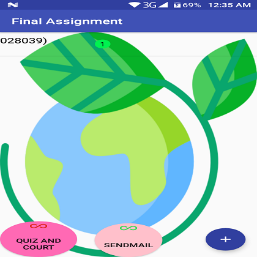
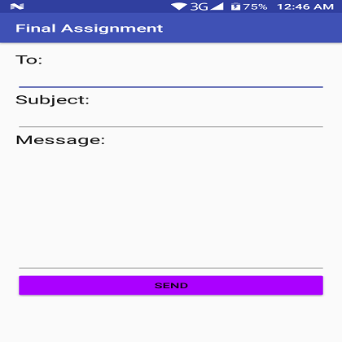
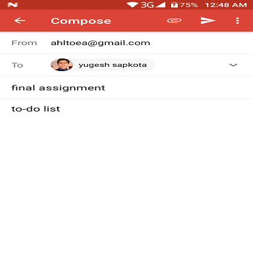
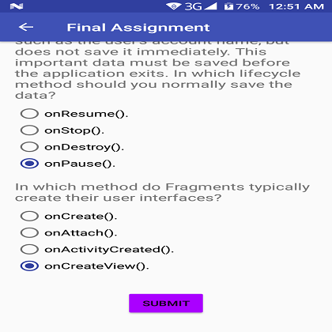
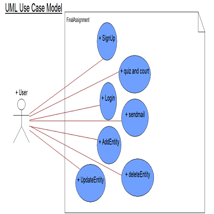
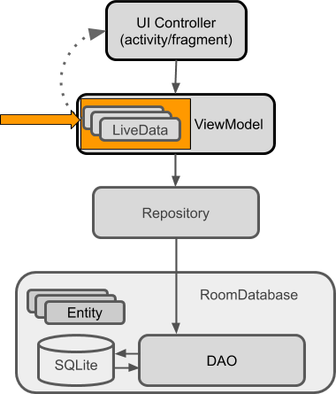

# FinalAssignment


## Screenshot
##login and register


##login sucess


##add entity


##Update entity


##delete entity


##send mail



##quiz and court



## General info
Image of use case and Architecture Components




## Usage
it is use to login ,add task ,sendmail and play quiz
```
```